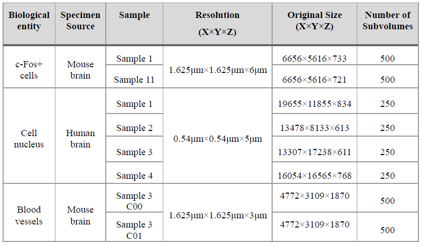

The Selma3D 2024 dataset consists of 35 large-scale 3D LSFM images of human and mouse whole brains; it encompasses diverse stained biological structures including blood vessels,
c-Fos + cells, cell nuclei and amyloid-beta plaques. It also includes 89 small volumes annotated with binary segmentation masks of the previously mentioned structures. 
Due to the cellular resolution of LSFM, imaging a whole brain can result in a volume size of several hundreds of gigabytes or even a few terabytes, which makes training
and managing several of these volumes impossible for a regular laptop. To overcome this issue, the following approach was taken: each unannotated volume consists of 
several 2D 16-bit signed TIFF files, so a Python script was created to extract random 250x250x250 subvolumes by cropping and stacking the necessary 2D slides, ensuring 
with an Otsu threshold that each subvolume contains significant foreground. This results in manageable information-rich 3D images that can be used for training instead 
of the original large-scale volumes. Due to time and memory limitations, not all volumes were sampled; the table below contains information about which volumes were 
sampled for each entity, their original properties and the number of subvolumes taken from each.

The amyloid-beta plaques were excluded in favor of giving more representation to cells, nuclei and vessels as these entities are usually more present in microscopy 
data and research. In total, a thousand subvolumes of unannotated data for each entity were obtained, with equal representation for each of the selected samples. 
For the nucleus, all the provided volumes were sampled as each represented a different region of the brain (hippocampus, motor cortex, sensory cortex and visual cortex). 
For vessels, two channels were provided for each volume: C00 marks microvessels and C01 marks major vessels. Due to the previously mentioned constraints, only one 
volume was sampled, with each channel providing diverse representation. For the annotated volumes, they were used as given by the sources; 19 c-Fos+ cell NIfTI 
patches of size 100x100x100, 24 blood vessel patches of size 500x500x50 with separated files for each channel which share the same segmentation mask, and 12 cell 
nucleus patches of size 200x200x200.
